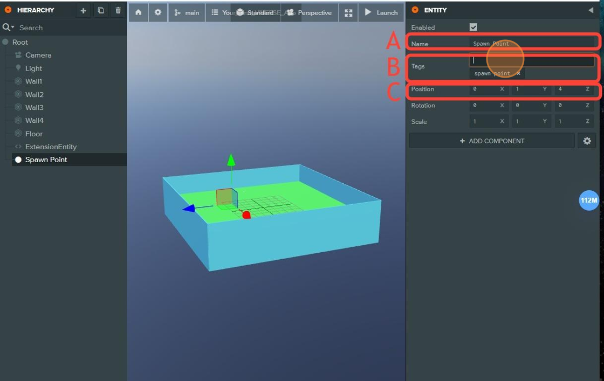

# Setting Up Your PlayCanvas Project for VIVERSE

This document provides several guides that can be used to setting up the Project scene in Playcanvas editor before publishing onto VIVERSE Create.

***

## Spawn Point

### Create An Entry Point For Your Avatar to Enter The Scene

To create a spawn point, right-click on the **Root** object and select **New Entity > Entity**. This entity will serve as the initial location where user avatars spawn or respawn. Please make sure your spawn point is above “ground”, to prevent the avatars from falling through the map.


Make sure to disable any camera/character control entity in the scene. As it might conflict with VIVERSE avatar system.




### Creating A Spawn Point

A. Rename the entity to **Spawn Point**.

B. Add the `spawn-point` tag to the **Tags** field.

C. Set the values for the **Position** to (**0, 1, 4**) for **X, Y, Z**.



<figure><figcaption></figcaption></figure>

## Collider

### Setup The Floor Plan For Your Avatar To Walk And Stand On

This tutorial guides you through the process of creating floor plan for for you avatar to land and walk on.



### Creating the Floor Entity

Configure the **Plane** object to become a floor that will prevent the avatar from falling through.

A. Rename the **Plane** to Floor.

B. Set the **Scale** to **(20, 1, 20)** for **X, Y**, **Z**.

C. Click the "**Add Component**" button. Select **Physics > Collision** to add a **Collision** component. Click the "**Add Component**" button again and select **Physics > Rigid Body** to add a **Rigid Body** component.

D. Resize the collider to cover the entire space of the Plane object by setting **Half Extents** field to (**10, .1, 10**) for **X, Y**, **Z**.

E. After the **Floor material** is created in the next step, it can be added here.

<figure><figcaption></figcaption></figure>



### **Creating The Floor Material**

Right-click in the **Assets** window and select **New Asset > Material**.

A. Rename the material to **FloorMaterial**.

B. Expand the **Diffuse** section and click the **Color** field. Set the values to (**97, 255, 104)** for **r, g, b**. Add it to the **Materials** section on the **Floor** object.

<figure><figcaption></figcaption></figure>



### **Creating The First Wall**

Configure the walls to prevent the avatar from falling off the map. Select the **Box** in the scene and enable it.

A. Rename the **Box** to **Wall1**.

B. Set the values for the **Position** to (**0, 0, 10**) for **X, Y, Z**.

C. Set the values for the **Scale** to **(20, 5, .1)** for **X, Y**, **Z**.

D. Click the "**Add Component**" button. Select **Physics > Collision** to add a **Collision** component. Click the "**Add Component**" button again and select **Physics > Rigid Body** to add a **Rigid Body** component.

E. Resize the collider to cover the entire space of the wall object by setting **Half Extents** to (**10, 2.5, .1**) for **X, Y, Z**.

F. After the **Wall material** is created in the next step, it can be added here.

<figure><figcaption></figcaption></figure>



