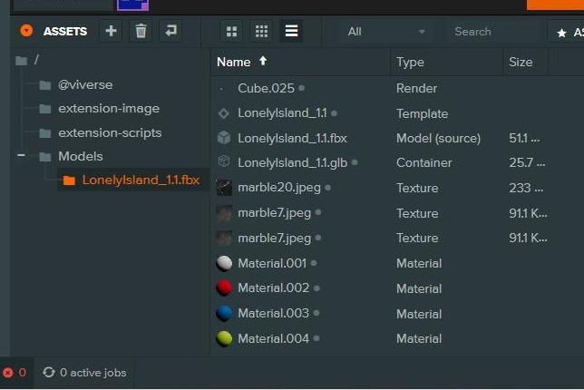

# Pet Rescue Template

***

## Setup 3D Environment

A 3D environment needs to be added to the template project. The basic process is in the following guide, but the process can differ based on projects.



### Add the 3D model to the project

A. In the **Assets** window, create a new folder called **Models**.

B. Drag your 3D model into the **Assets** window.

<figure><figcaption></figcaption></figure>



### Add 3D model to the scene

A. Locate the 3D model's **Template** file inside the folder that was generated by the 3D model that was added to the **Assets** window.

B. Drag the **Template** file to the Hierarchy. In the sample project, lights were added to the model.

C. Update **Position, Rotation** and **Scale** of the model.

<figure><figcaption></figcaption></figure>



### Add and configure the collider

A. In the Hierarchy, create a new entity for the collider.

B. Add a **Collision** component.

C. Change the collision type to **Mesh**.

D. Add the **Render** file to the **Render Asset**.

E. Add a **Rigidbody** component.

F. Update the **Position, Rotation** and **Scale** in order to match up the collider with the model.

<figure><figcaption></figcaption></figure>



## Setup Spawn Point

The spawn point is already added to the template project, but needs to be configured for a desired Position and Rotation.



### Create a spawn point

A. In the **Hierarchy**, add a new entity.

B. The spawn point's name is arbitrary, but the **spawn-point** tag needs to be added.

C. Update the **Position** and **Rotation** so that the location is above the ground.

D. At this point, the game can be published to VIVERSE for testing, ensuring that the avatar can traverse the environment.

<figure><figcaption></figcaption></figure>



## Setup Cat Groups

The cat groups are already added to the template project, but groups can be added or removed as needed.



### Configure cat groups

A. A parent entity called Cats which holds the cats and hiding positions.

B. **GroupA**, **GroupB**, **GroupC** and **GroupD** have been created. Cats are grouped based on poses. Groups can be added or removed.

<figure><figcaption></figcaption></figure>



## Setup Cat Hiding Positions

The cat hiding positions are already added to the template project, but hiding positions can be added or removed as needed. Moving and rotating the cat hiding positions is recommended as opposed to moving and rotating the cat models.



### Configure cat hiding positions

A. Each group has several hiding positions. In the sample, the positions under **GroupA** are named **A1, A2, A3,** etc.

B. Update the **Position** and **Rotation** for each hiding spot. Adding a cat model under the position can help with visually placing the position.

<figure><figcaption></figcaption></figure>



## Setup Cat Models

The cat models are already added to the template project, but cat models can be added or removed as needed.



### Cat models

A. Cat models are located in the **Models/Cats** directory.

<figure><figcaption></figcaption></figure>



### Adding cat models in the scene

A. For each cat, drag the **Template** from the **Assets** window to a hiding position in the **Hierarchy**.

B. Select the cat in the **Hierarchy**.

C. Update the **Scale** for the cat model so the size is appropriate for the environment.

<figure><figcaption></figcaption></figure>



### Disable The Cats

A. Select all the cats in the groups and **disable** them so that they are disabled by default.

<figure><figcaption></figcaption></figure>



## Setup Catbox

The Catbox is already added to the template project, but needs to be configured for a desired Position, Rotation and Scale.



### Add the catbox to the scene

A. Drag the **Catbox** **Template** to the Hierarchy.

B. Place the **Catbox** under the **Cats** object.

C. Update the **Position, Rotation** and **Scale** of the **Catbox** to the appropriate parameters for the environment.

<figure><figcaption></figcaption></figure>



### Add cat collect positions to the Catbox

A. Create a new entity for each cat under the **CatBox** entity. In the sample, the entities are **cat\_1\_collect, cat\_2\_collect**, etc.

<figure><figcaption></figcaption></figure>



### Configure cat collect positions

A. Add the **cat\_collect** tag to each cat collect position.

B. Update the **Position, Rotation** and **Scale** of the cat collect positions to place the cats in the appropriate locations.

<figure><figcaption></figcaption></figure>



### Add the cat models to the cat collect positions

A. Add the cat models and paste them under their respective cat collect positions.

B. Update the **Scale** of each cat model to **(.01,.0 1, .01)**.

<figure><figcaption></figcaption></figure>



### Disable the cat collect positions

A. Select all the cat collect positions under the **CatBox** entity.

B. Disable all the cat collect positions so that the cats are hidden.

<figure><figcaption></figcaption></figure>


