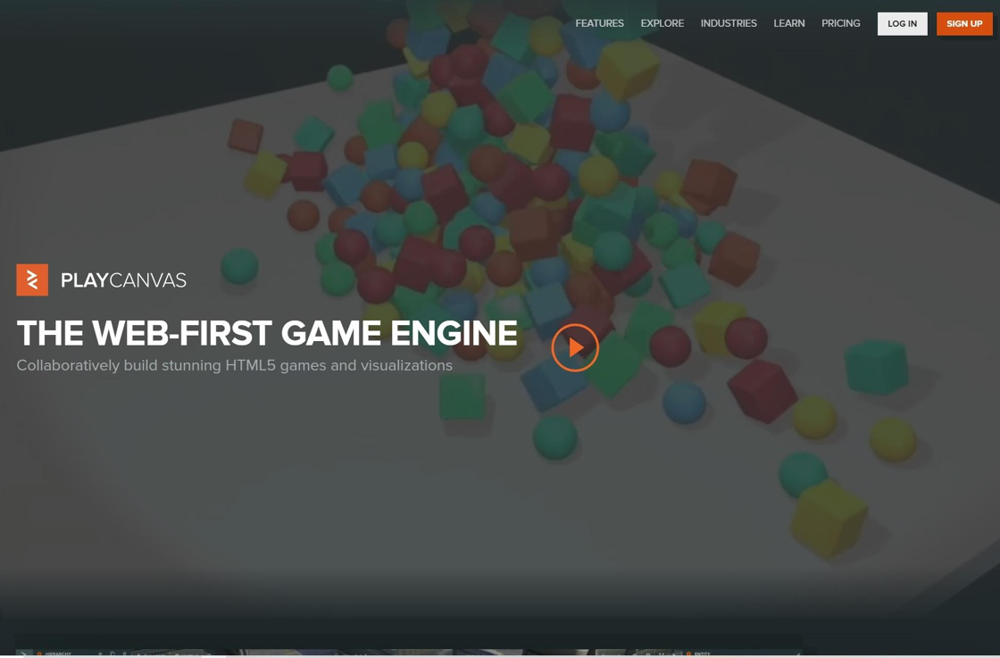
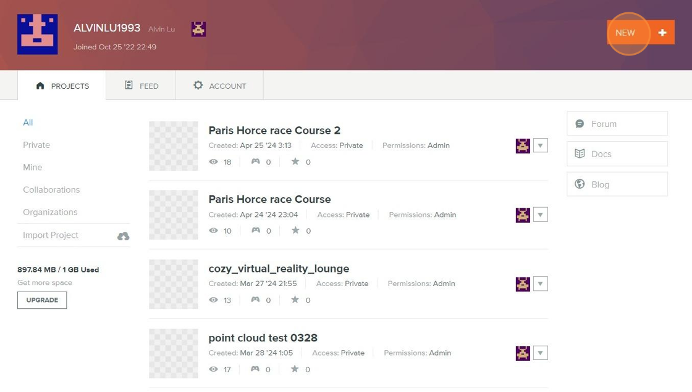
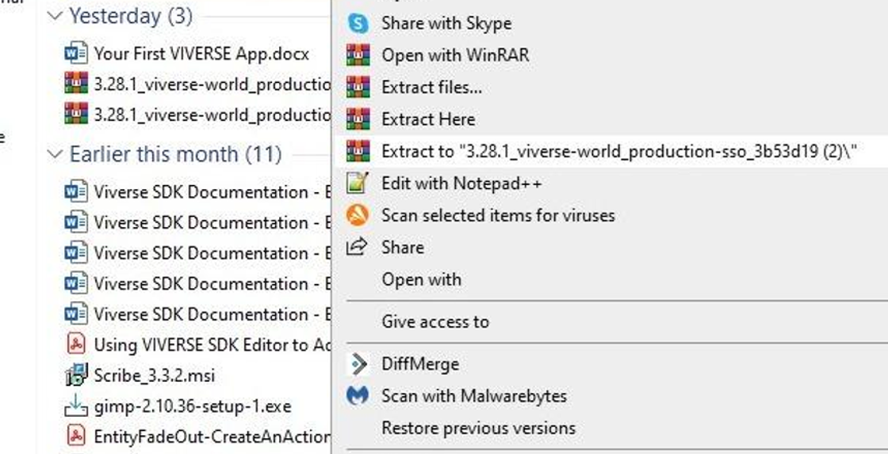
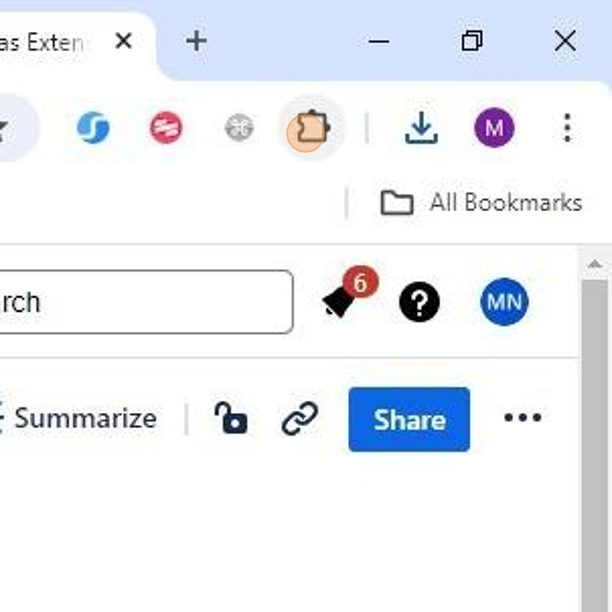
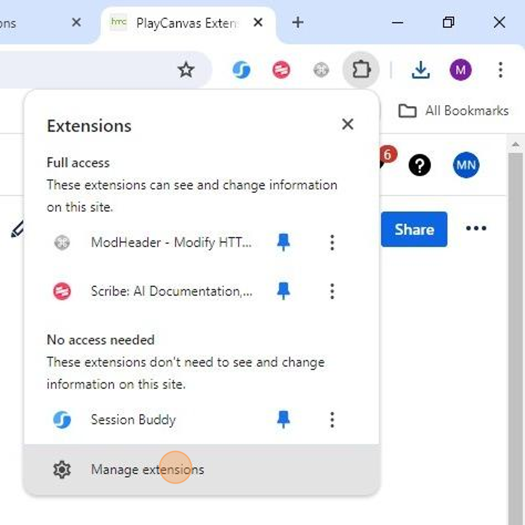
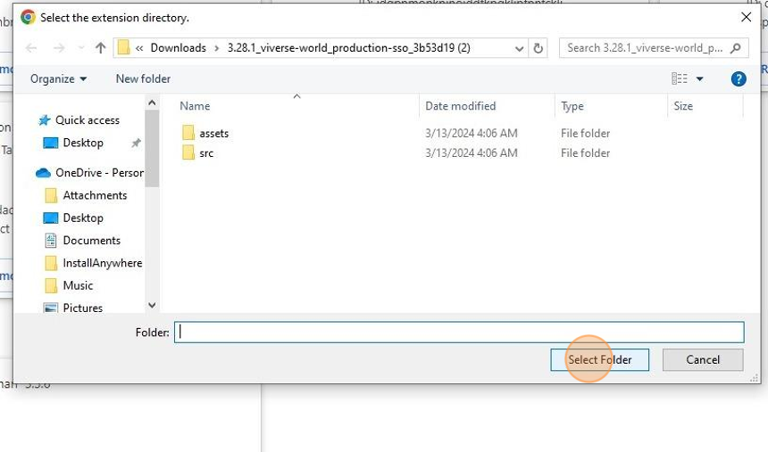
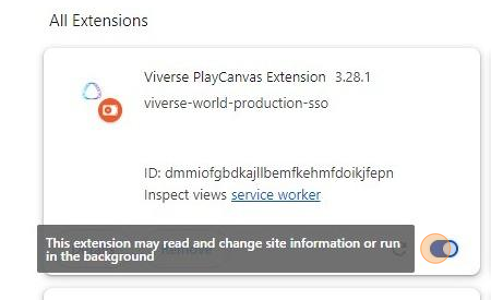

# PlayCanvas Extension Setup

***

## Pre-Requisites

* A VIVERSE Account
* Google Chrome

## Create Your PlayCanvas Account

PlayCanvas is an open-source game engine that we have implemented in the frontend of VIVERSE. Creators will use the PlayCanvas Editor to publish fully-functional worlds to VIVERSE. PlayCanvas has options for both **free** and **paid** accounts. Paid accounts allow for extra storage and private projects.


Be sure to use the same email address to create your PlayCanvas account as you used for your VIVERSE account.




### Begin PlayCanvas Account Setup

Navigate to [PlayCanvas.com](https://playcanvas.com/) and click the Sign Up button to begin account creation.




### Sign Up For A PlayCanvas Account

Fill out the Playcanvas Account form with the same email address that was used to create the VIVERSE Account to ensure integration, then click Sign Up.




### Create A New Project

After logging into Playcanvas, click the **New** button to create a new Playcanvas project.




## Install The PlayCanvas Extension

_This guide is a walkthrough for adding Playcanvas Extension to the Chrome browser and will allow creation and publishing Scene of Playcanvas projects to_ VIVERS&#x45;_._



### Download The Extension

[Download](playcanvas-extension-setup.md#download-the-latest-extension-version) the latest version of the Playcanvas Extension.



### Unzip The Downloaded File




### Open Your Chrome Extensions

Click "**Extensions**" in the browser toolbar.




### Open The Extension Editor

Click "**Manage extensions**" in the menu.




### Enable Developer Mode

Enable **Developer mode** on the Extensions tab.




### Load The Extension

Click **Load unpacked** on the Extensions tab.




### Select The Unziped Extension

Navigate to the folder where the extension was extracted. Click **Select Folder**.




### Verify The Extension Set Up

Confirm the extension is enabled on the Extensions tab.




## PlayCanvas Extension Download

#### [Download the latest extension version](https://htc-directus-dev-usw2-pc-ui-ext.s3.amazonaws.com/viverse-world/production-sso/3.43/3.43.1_viverse-world_production-sso_090fcab.zip)

#### Change Log

<table><thead><tr><th width="160">Release Date</th><th width="125">Version</th><th>Release Notes</th></tr></thead><tbody><tr><td>2/6/2025</td><td>3.43.1</td><td>

<ul><li>Add 3 features in Trigger &#x26; Action - EntityAssetUnload, EntityAssetReload, EntityAssetDestroy</li></ul></td></tr><tr><td>1/7/2025</td><td>3.40.7</td><td>

<ul><li>Add post effects settings</li></ul><ul><li>Add scene ownership check on publish tab</li></ul></td></tr><tr><td>12/3/2024</td><td>3.38.0</td><td><ul><li>Handle response err message from PlayCanvas server job api</li><li>Fix service worker error</li></ul></td></tr><tr><td>12/27/2024</td><td>3.36.4</td><td><ul><li>Error handling when publishing the scene</li></ul></td></tr><tr><td>10/21/2024</td><td>3.35.19</td><td><ul><li>Support latest Chrome version</li></ul></td></tr></tbody></table>

We created a Playcanvas [sample project](https://playcanvas.com/editor/scene/1984713) based on Playcanvas extension 3.40.7, which contains several demos that you can try on your own.

## Next Steps

Now that you have successfully set up your PlayCanvas account and installed the VIVERSE PlayCanvas extension, see the first steps of creating a project [here](setting-up-your-playcanvas-project-for-viverse.md).
